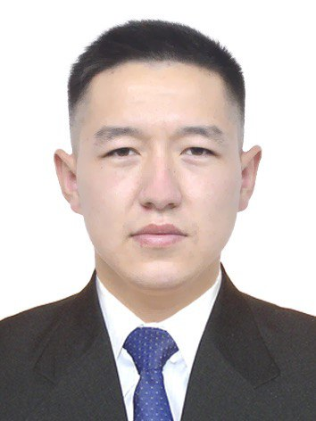

# jusan

**О себе** 👤

---------------------------------------------------------------------
Меня зовут **Нуртаев Адилет**, мне 30 лет. Я родом из **Восточно-Казахстанской области**. В 2018 году окончил **Satbayev University** по специальности «Информационные технологии». Увлекаюсь IT-сферой, люблю изучать новые технологии и развиваться в программировании. Ранее работал системным администратором, инженером и инженером-программистом.
Интересный факт: я с детства интересовался техникой и всегда мечтал работать в сфере информационных технологий.

**Почему я хочу учиться в вашей школе** 🎯
----------------------------------------------------------------------
*Я выбрал вашу школу, потому что у неё высокий рейтинг и отличные отзывы. Мне близка выбранная специальность — она соответствует моим профессиональным интересам и опыту. Хочу углубить знания в веб-разработке и научиться использовать современные технологии в реальных проектах. Уверен, что обучение в вашей школе поможет мне выйти на новый уровень в карьере и добиться поставленных целей.*

**Мои ключевые интересы:**
---------------------------------------------------------------------
___Работа с серверной частью___ 
___Автоматизация и DevOps___

**Почему я смогу завершить 8-месячное обучение** 💪
---------------------------------------------------------------------
*Я уверен, что смогу успешно пройти обучение, потому что у меня есть опыт работы в IT и высокая мотивация. Я умею планировать своё время и настроен серьёзно учиться. Уверен в своих силах и ставлю перед собой цель — завершить обучение с отличием. Поддержка со стороны семьи и стремление к развитию помогают мне двигаться вперёд, несмотря на любые трудности.*

>"Не важно, как медленно ты продвигаешься, главное — не останавливаться." — Конфуций

---------------------------------------------------------------------
**Мои проекты 🛠️**
___У меня еще нету серезных проектов, но скоро будет!___
